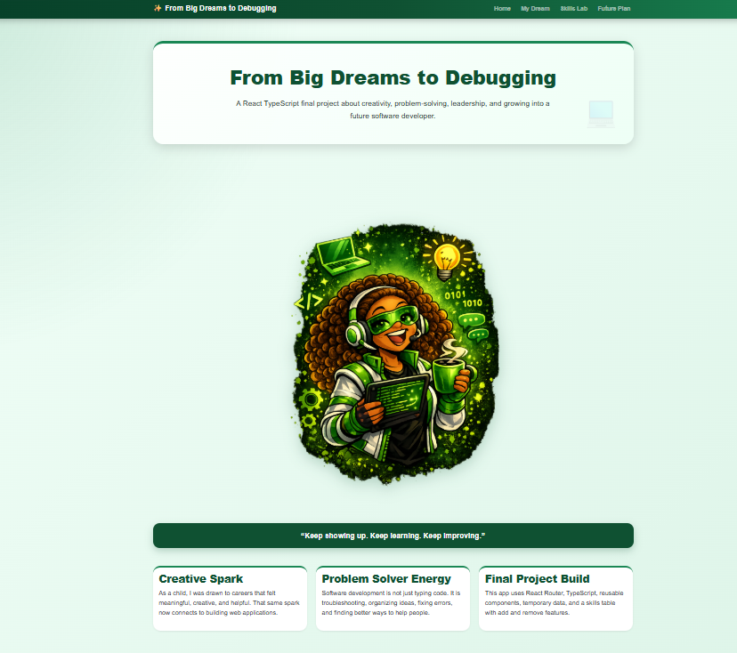
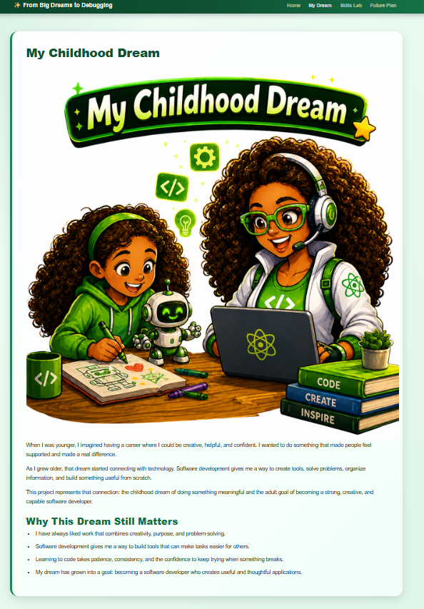
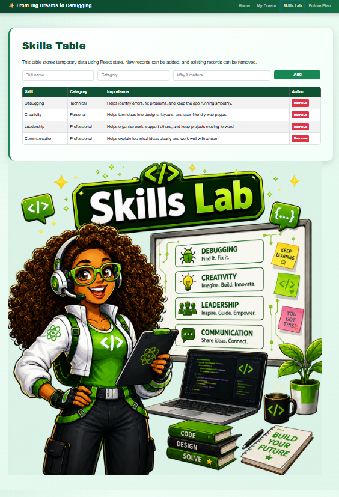
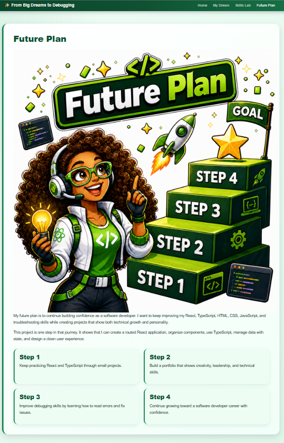

# From Big Dreams to Debugging

An interactive React and TypeScript website about creativity, problem-solving, leadership, and my journey toward becoming a software developer.

## Project Overview

**From Big Dreams to Debugging** was developed as a React and TypeScript final project. The website connects my childhood interest in creative and meaningful work with my current goal of building useful software solutions.

The project demonstrates frontend-development fundamentals through a multi-page user experience, reusable components, custom styling, responsive layouts, and a dynamic skills table that allows users to add and remove records.

## Key Features

- Multi-page website with reusable navigation
- Consistent green visual theme and branded illustrations
- Responsive page layouts
- Custom content sections and card components
- Interactive skills table
- Add and remove functionality using React state
- Form inputs for skill name, category, and personal significance
- Career-development roadmap organized into four steps

## Pages

### Home

Introduces the project theme, personal motivation, and core strengths:

- Creative Spark
- Problem Solver Energy
- Final Project Build

### My Dream

Explains how a childhood interest in creative and meaningful work developed into a goal of becoming a software developer.

### Skills Lab

Includes an interactive skills table powered by React state. Users can add new records and remove existing entries.

Initial skill categories include:

- Debugging
- Creativity
- Leadership
- Communication

### Future Plan

Presents a four-step roadmap for continued growth:

1. Continue practicing React and TypeScript through small projects.
2. Build a portfolio that demonstrates creativity, leadership, and technical skills.
3. Improve debugging skills by learning how to identify and resolve errors.
4. Continue growing toward a software-development career with confidence.

## Technologies Used

- React
- TypeScript
- HTML
- CSS
- React State Management
- Reusable Components
- Responsive Web Design

## Screenshots

### Home Page

### My Childhood Dream

### Interactive Skills Lab

### Future Plan

## What I Learned

This project strengthened my ability to:

- Build reusable React components
- Organize a multi-page frontend project
- Use TypeScript in a React application
- Manage dynamic data using React state
- Create forms that update the interface
- Design consistent and responsive layouts
- Translate a creative idea into a functional website

## Future Improvements

- Add form validation and user-friendly error messages
- Save skills-table entries with local storage or a database
- Improve accessibility with keyboard navigation and ARIA labels
- Add automated tests
- Deploy the project online
- Optimize the design for additional screen sizes

## Author

**Woodna Adrien**  
Computer Science Graduate | Junior Software Developer | Application Support | QA Testing
